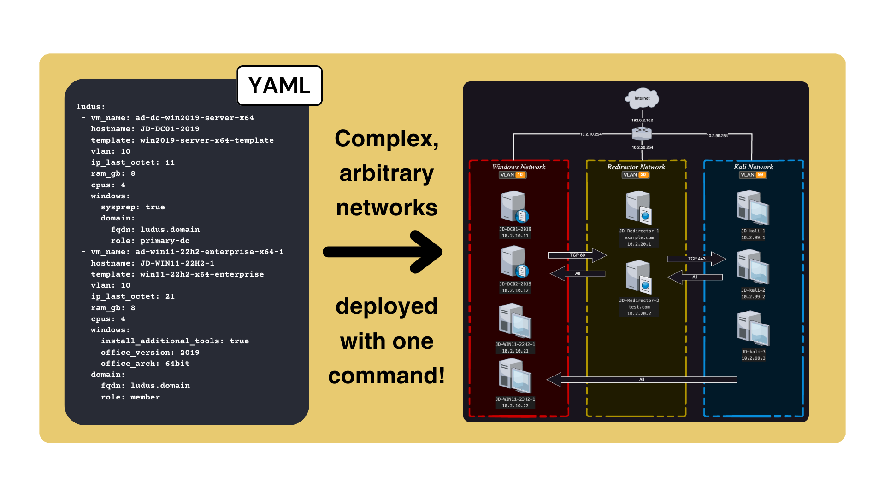
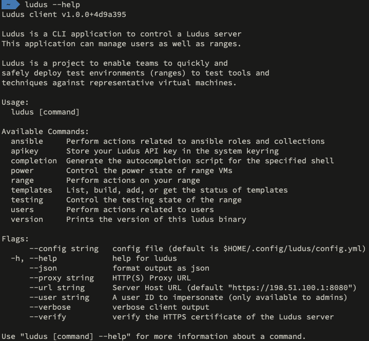
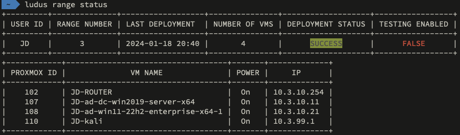
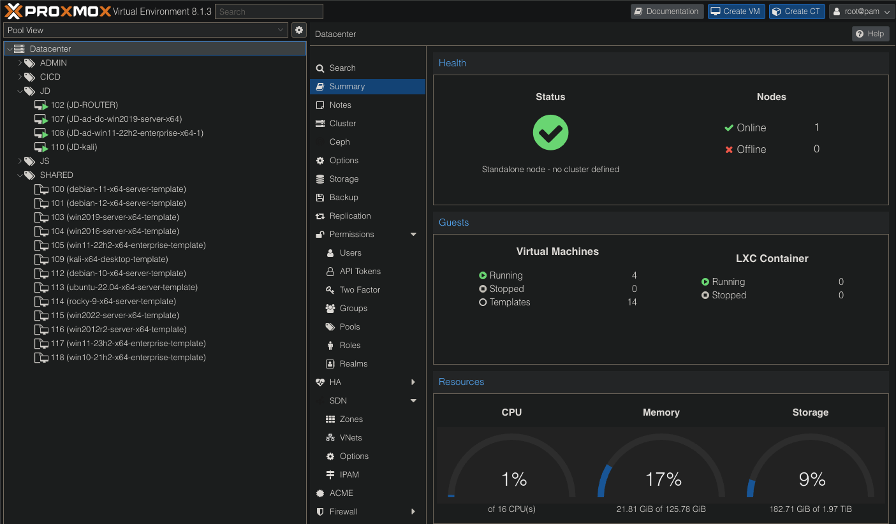

# Ludus

  

    <em>🏛️ self-hosted, 🤖 automated, 🚀 fast deployments, 🤯 complex networks, 👥 multi-user, 🧑‍💻 API driven</em>

## 🏟️ Ludus

Ludus is a system to build easy-to-use cyber environments, or "ranges" for testing and development.

Built on [Proxmox](https://www.proxmox.com/en/), Ludus enables advanced automation while still allowing easy manual modifications or setup of virtual machines and networks.

  

## 📚 Docs

All documentation can be found at [docs.ludus.cloud](https://docs.ludus.cloud) (and `https://<ludus IP>:8080/ludus` once your Ludus server is installed).

## 🌟 Features

- **Automation**: From a Debian 12 install to a deployed virtual Active Directory network with a few simple commands
- **Complex Networks**: Users can define up to 254 arbitrary /24 networks and control traffic flow between them
- **OPSEC**: *Testing mode* snapshots VMs and blocks them from the internet, allowing you to test without telemetry - and selectively allow domains or IPs to test live C2 channels
- **Ansible**: Ludus supports deploying arbitrary ansible roles to VMs. Install from ansible galaxy, a URL, or a local directory
- **Templates**: Use Packer HCL or json files to create your own templates (13 included!)
- **Multi-User**: Collaborate with your team, or keep your environment to yourself

## ⚡️ Quick start

1. Grab the `ludus-server` binary and copy it to a clean Debian 12 host
2. Run the `ludus-server` binary to convert the Debian 12 host into a Ludus host
3. Follow the [Quick Start](https://ludus.cloud/docs/category/quick-start) documentation to get templates built and a range deployed

## 📷 Screenshots

### Help

### Range Status

### Proxmox with a Simple Range Deployed

## 🎥 Demos

### Install

{width=100%}