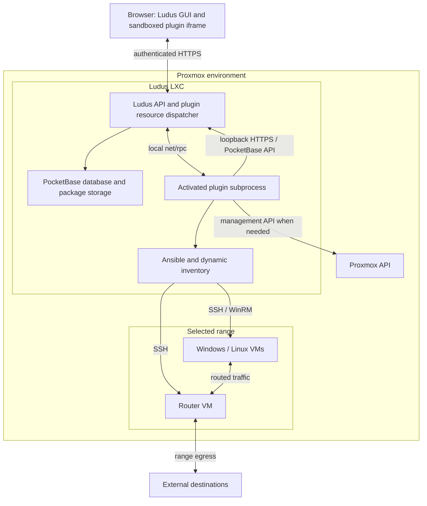

# Plugin architecture

This document describes the Resources → Plugins implementation in the current
RPC integration working tree, reviewed September 23, 2026. It covers GUI-uploaded
plugins and uses Traffic Observer 1.0.1 as a concrete example. It describes
implemented behavior, including limitations, rather than a proposed design.

**Uploading a plugin stores a package in the Ludus appliance. Activating it runs
its backend there. Installing software on range machines is a separate action
implemented by the plugin.** Uploading a ZIP does not automatically install it on
Proxmox, distribute it to every range, or start a capture.

See [RPC plugins](./rpc-plugins.md) for authoring details and
[Proxmox LXC deployment](../deployment-options/proxmox-lxc.md) for the appliance
deployment model.

## 1. Where everything runs

In the LXC deployment, the Ludus appliance is an unprivileged container on
Proxmox. Range VMs, including their routers, run on Proxmox alongside that
container; they are not VMs nested inside the Ludus container.



| Component | Location and responsibility |
| --- | --- |
| Ludus GUI | Browser; owns login, plugin inventory, range selection, and the frontend bridge. |
| Main Ludus service | LXC, running as `ludus`; validates packages, checks access, starts uploaded plugin processes, and dispatches RPC. |
| Admin Ludus service | LXC, running as `root`; separate privileged server path. GUI uploads do not install root-side plugins here. |
| PocketBase | Embedded in Ludus services; persists users, ranges, and plugin resources. Plugin SDK clients use its HTTP API rather than opening its database. |
| Plugin executable | Child process of the main service, inside the LXC; implements routes, initialization, and optional jobs. |
| Ansible | Runs in the LXC when invoked by plugin code; connects to the selected range's machines. |
| Proxmox | Hosts and manages VMs and networking. Uploading a GUI plugin does not install a Proxmox-side daemon. |
| Range router and guests | Receive only changes explicitly performed by plugin code or its playbooks. |

The default main and admin API ports are 8080 and 8081. The plugin's parent API
connection uses loopback inside the LXC. Browser access may be direct or through
deployment-specific forwarding; forwarding is not part of the plugin protocol.

## 2. Upload: authenticated bytes become an inert resource

The GUI sends a raw ZIP to `POST /api/v2/plugins/install` using the user's Ludus
authentication. The ordinary GUI uses its PocketBase bearer token; existing
Ludus API authentication also applies to API clients.

The server:

1. Requires an authenticated Ludus user. A PocketBase superuser is not an upload
   identity. Ownership comes from the actual authenticated uploader, not an
   impersonation query parameter.
2. Defaults to a personal installation. `allUsers=true` is accepted only for an
   administrator.
3. Validates the archive and manifest without executing the plugin.
4. Checks the target scope for an existing copy and enforces upload limits.
5. Creates a `plugin_resources` record, stages the extracted files into a fresh
   generated directory, and records the archive's SHA-256 digest.
6. Returns the new resource with state `pending`.

### Package contract

```text
plugin.json
plugin             optional native executable
ui/index.html      optional self-contained frontend
```

These are the only permitted entries, and they must match the manifest. Directory
entries, enclosing folders, additional assets, symlinks, duplicate entries, and
path traversal are rejected. At least a backend or frontend is required.

```json
{
  "schemaVersion": 1,
  "id": "example-plugin",
  "name": "Example Plugin",
  "version": "1.0.0",
  "executable": "plugin",
  "protocolVersion": 2,
  "ui": "ui/index.html",
  "rangeScoped": true
}
```

| Limit | Current value |
| --- | --- |
| ZIP body / expanded executable | 128 MiB each |
| HTML / manifest | 2 MiB / 64 KiB |
| Stored packages per owner | 20 |
| Pending packages per owner | 5 |
| Plugin ID | 2–64 lowercase letters, digits, or hyphens; starts with a letter |

The executable must target the appliance's operating system and architecture.
Archive validation is not a publisher signature check or a security review.
The stored checksum identifies the uploaded bytes; it does not establish trust.

### Storage in the LXC

With the default data directory:

```text
/opt/ludus/db/
  data.db                         PocketBase data, including plugin_resources
  plugin-packages/
    <resourceID>/
      plugin.json
      plugin
      ui/index.html
  plugin-state/
    traffic-observer/             example: plugin-managed assets and CA
```

Package directories are mode `0700`; extracted files start as `0600`. Activation
makes the executable `0700`. The original ZIP is not retained as a separate
archive. A nondefault `DataDirectory` relocates package storage accordingly.

The resource record stores the manifest, digest, owner, sharing settings, state,
and error details. Direct PocketBase collection CRUD is locked down; clients use
the dedicated resource endpoints. Uploads use a database transaction and staged
filesystem writes with failure cleanup. This is not a single crash-atomic
transaction spanning SQLite and the filesystem.

## 3. Ownership, scope, and identity

Three identifiers must not be confused:

| Identifier | Meaning |
| --- | --- |
| Manifest `id`, also returned as API `id` | Plugin product identity, for example `traffic-observer`. Multiple installations may have this value. |
| `resourceID` | Generated PocketBase ID identifying one installation. Use this for UI, RPC, updates, and deletion. |
| `rangeID` | Selected Ludus range. RPC also carries the corresponding database `RangeRecordID`. Neither is a plugin ID. |

Personal uniqueness is `(pluginID, owner)`. Global and system installations each
have their own uniqueness scope. PLUGA and PLUGB can therefore upload the same
ZIP as two personal resources, and an administrator can install a third global
copy. Each gets its own package directory and runtime lifecycle.

| Action | Personal owner | Other user with shared access | Administrator |
| --- | --- | --- | --- |
| View/open an accessible plugin | Yes | Yes | Yes; administrators can see all resources |
| Upload a personal copy | Yes | Yes | Yes |
| Activate, replace, or delete a personal copy | Own copy | No | Yes |
| Share a personal copy with selected users | Own copy | No | Yes |
| Install or manage a global copy | No, unless also admin | No | Yes |
| Remove a shared copy from one's own list | Not a substitute for deleting one's own copy | Yes; does not delete it for others | Administrative management is separate |

Sharing uses allowed-user entries; individual opt-outs use excluded-user entries.
Changing scope fails with a conflict if the destination scope already contains
that plugin ID. Legacy slug URLs prefer the caller's personal copy, then a global
copy, then a single unambiguous visible match. Explicit `resourceID` avoids
ambiguity, especially for administrators.

**Plugin access never grants range access.** The normal range authorization and
the plugin resource authorization both apply to a range-scoped RPC request.
Administrators retain their existing broader range permissions.

## 4. Activation: the trust and execution boundary

The owner of a personal resource, or an administrator, explicitly activates it.
Only administrators can activate global resources. UI-only packages also require
activation, but do not start a backend process.

For executable packages, activation:

1. Starts the executable through HashiCorp go-plugin with local `net/rpc`.
2. Checks the Ludus handshake and protocol compatibility.
3. Reads metadata and verifies that ID, name, and version match the manifest.
4. Validates route declarations and rejects VM lifecycle hooks for GUI uploads.
5. Sends initialization data: serialized server configuration, server state,
   SDN mode, and a connection to the parent PocketBase HTTP API.
6. Accepts valid scheduled jobs and associates their lifetime with this runtime.
7. Saves the resource as `approved`; the API reports `running` while its runtime
   is available.

Initialization is plugin code: it can have side effects before the user opens
the frontend. The platform does not automatically prepare ranges, but it does
not enforce that arbitrary plugin initialization is side-effect-free.

### What “private” does and does not protect

Resource permissions protect normal API and GUI access. They are **not a native
code sandbox or a separate operating-system identity for each uploader**.

All uploaded backends run with the main Ludus service account's authority. The
LXC service has systemd hardening and writable access to `/opt/ludus`, but no
per-resource filesystem, network, or credential isolation is created.
Initialization supplies server configuration and privileged API access. The
PocketBase token is issued for `root@ludus.internal`, not for a restricted
per-plugin or per-user principal. The SDK pins the loopback server certificate
and refreshes the token; these protect the connection, not the authorization
scope of that token.

Consequently, trusted plugin code must honor the supplied user and range context.
A malicious backend can bypass intended application-level isolation using its
service privileges and credentials. Allowing users to activate native plugins
means trusting them to supply server-side code. Do not describe this design as
safe execution of arbitrary untrusted tenant code.

## 5. Opening the frontend and making a request

The Resources → Plugins page fetches the installation's frontend from
`/api/v2/plugins/<resourceID>/ui`. The response contains HTML and the bridge
version. The GUI renders it in a `srcDoc` iframe with `sandbox="allow-scripts"`,
without `allow-same-origin`, and with a restrictive content security policy.

The iframe has no Ludus login token, parent DOM access, or direct network access.
Scripts and styles must be inline; images and fonts can use data URLs. A native
backend is much more privileged than this sandboxed frontend.

The injected `window.ludus` bridge provides context, requests, downloads,
confirmations, and notifications. Context contains the manifest plugin ID,
selected range ID, theme, and bridge version. The parent separately owns the
installation's `resourceID`.

```mermaid
sequenceDiagram
  participant UI as Plugin iframe
  participant GUI as Ludus GUI parent
  participant API as Ludus API
  participant P as Plugin process
  participant PB as Parent PocketBase API
  participant VM as Selected range machines
  UI->>GUI: ludus.request('/status')
  GUI->>GUI: Validate sender and path; attach selected range
  GUI->>API: Authenticated /plugins/resourceID/rpc/status
  API->>API: Check normal range access and resource access
  API->>P: RPC Handle with route, HTTP data, auth/user/range IDs
  P->>PB: Reload records through SDK HTTP client
  PB-->>P: User and range records
  opt Handler needs machine state or changes
    P->>VM: Ansible from LXC over SSH / WinRM
    VM-->>P: Results
  end
  P-->>API: Status, selected response headers, body
  API-->>GUI: HTTP response
  GUI-->>UI: Bridge result
```

The parent validates `message.source`, restricts paths to this installation, and
prevents plugin-supplied `userID` or `rangeID` overrides. Range choices come from
the current account's authorized range list. The parent adds authentication and
calls `/api/v2/plugins/<resourceID>/rpc/<path>?rangeID=...`.

Normal middleware establishes authorized range context before plugin dispatch.
The dispatcher checks current resource visibility, availability, and the exact
declared HTTP method/path. Supported methods are GET, POST, PUT, PATCH, and
DELETE; uploaded routes do not need host placeholders or a GUI rebuild.

RPC carries the route name, legacy-compatible API path, query, headers, body,
remote address, and authenticated record IDs. The SDK reconstructs the handler's
request event by fetching records through the parent API. Original HTTP headers
can reach the trusted backend; the promise that login credentials are not exposed
applies to the iframe, not to native plugin code.

Bridge requests are limited to 8 MiB and eight concurrent calls, with a five-minute
bridge timeout. Context changes cancel browser fetches; they do not guarantee
that already-started backend work is canceled. Downloads are buffered and capped
at 64 MiB in the browser, not streamed. Response headers are restricted; plugins
cannot set arbitrary browser cookies through the bridge.

## 6. From the LXC to Proxmox and range machines

A plugin does not need a permanent agent on every VM simply to receive GUI
requests. Its handler chooses whether to read database state, call Proxmox, run
Ansible, or do something else.

When using Ludus's shared Ansible helpers, execution occurs inside the plugin
process's LXC environment. The helpers assemble dynamic inventory, server and
range configuration, selected-range variables, permissions, placement, and
Proxmox connection information. Sensitive Proxmox variables are placed in a
restricted temporary variables file rather than exposed directly as command-line
arguments. Playbooks connect to Linux machines over SSH and Windows machines
over WinRM using Ludus's inventory configuration.

Proxmox API calls manage hypervisor resources. Guest connections configure the
router or operating systems. These are different paths: changing a Windows trust
store is not installing something on the Proxmox host, and uploading an executable
to the LXC does not copy that executable to Windows.

There is no generic GUI-upload installation hook that automatically applies a
plugin to existing or future VMs. GUI-uploaded plugins advertising VM lifecycle
hooks are rejected because those calls do not yet carry resource ownership.
Administrator-installed system plugins have a separate lifecycle-hook mechanism.

## 7. Traffic Observer: concrete side effects

Traffic Observer makes the distinction between package installation and range
preparation visible.

| User action | Ludus LXC | Selected range router | Other range machines |
| --- | --- | --- | --- |
| Upload | Stores validated package and pending resource | No change | No change |
| Activate | Starts backend; extracts embedded Ansible assets; creates or reuses observer CA | No change | No change |
| Install / repair range | Runs observer install and CA playbooks | Installs capture tools, controller, units, and CA signing material | Installs public CA trust and supported browser configuration |
| Start capture | Validates range, selected addresses, and applicable policy; invokes control playbook | Starts capture and optional transparent MITM; adds relevant firewall rules | No capture agent installed by this action |
| Read status / decoded requests | Executes bounded reads and returns results through RPC | Supplies state and saved flow information | CA checks may query guest trust state separately |
| Export PCAP | Fetches temporary export and returns bounded download | Builds filtered export from packet files | No change |
| Stop | Invokes control playbook | Stops capture/MITM and removes observer interception rules; preserves data | CA trust remains |
| Purge | Invokes purge action | Stops capture and deletes capture/flow data | CA trust remains |
| Delete plugin resource | Stops backend and deletes its package and resource record | No automatic cleanup | No automatic CA removal |

### Assets and certificate ownership

The current state root is
`<DataDirectory>/plugin-state/traffic-observer`. Activation extracts playbooks and
the router role there and creates a self-signed RSA-3072 CA with a ten-year
validity when the expected CA files are absent. CA directories and files have
restricted permissions.

Range installation places the controller at
`/usr/local/sbin/ludus-observerctl` on the router. The router receives mitmproxy,
tcpdump, Python, iptables, systemd units, and the CA private signing material.
Capture and MITM services are initially stopped and disabled; boot cleanup is
enabled. Capture data lives under `/var/lib/ludus-traffic-observer` on the router,
not in the browser or the package directory.

Ordinary guests receive the **public CA only**. Windows uses the LocalMachine
Root certificate store. Linux installs the certificate into system trust and
updates the CA bundle; the playbook also merges Firefox certificate policy.
New or previously unreachable guests need Install / repair run again. This
uploaded version does not register an automatic new-machine CA hook.

### Capture and TLS data path

The GUI defaults TLS decryption and “Block QUIC to enable TLS inspection” to on.
Those are GUI defaults; an API caller must explicitly supply the corresponding
options. Selected source addresses are validated against the range subnet.

Packet capture runs on the router. For TLS inspection, selected TCP 80/443 traffic
is redirected to a transparent mitmproxy listener on port 18080, subject to the
plugin's destination exclusions. Optional UDP 443 rejection encourages clients
to fall back from QUIC. The plugin refuses TLS interception in Ludus testing mode
or when its external-traffic policy checks prohibit it.

The browser and LXC are the control and viewing path, not an always-on mirror of
all packets. Passive PCAP collection and decoded HTTP flow records are separate
outputs. A PCAP download is not automatically a plaintext HTTP transcript.

TLS decryption requires active interception and client trust. Packet duplication
alone cannot provide plaintext. Certificate-pinned applications, untrusted client
stores, traffic on other ports, and traffic that never traverses the router are
not guaranteed to appear as decoded HTTP. This is not universal decryption of
every TLS connection or same-subnet exchange.

The default retention budget is approximately 10 GB: tcpdump rotates 94 files
at 100 decimal MB each, while decoded flows use a separate approximately
100 MiB-per-file rotation with four backups plus the active file. File-boundary
overshoot and temporary exports mean this is **not a hard filesystem quota**.
The much smaller browser export limit still applies.

### Shared state is an explicit current limitation

Multiple private Traffic Observer installations have separate resource records
and backend processes, but they use the **same plugin-state directory, CA, and
asset paths**. Router services and capture state are also per range, not per
plugin resource. Current per-range operation locks exist within each backend
process, not across all copies.

Therefore, private installations do not imply separate signing authorities,
versioned Ansible assets, or independent captures on the same range. Different
versions can overwrite shared extracted assets; two authorized copies can act on
the same range's observer. This does not itself grant a user access to another
range through the dispatcher, but it is an important operational isolation limit.

**Stop captures before deleting the plugin if the intention is to stop
observation.** Deleting its LXC process does not stop services already running on
a router, remove its firewall rules, revoke its CA, or erase plugin-created data.

## 8. Replacement, restart, and removal

| Operation | Platform behavior |
| --- | --- |
| Replace version | Explicit replacement required within the target scope. Validates/stores a new resource, preserves owner/access settings, stops the old process, removes old package files, and leaves the replacement pending activation. |
| Failed upload | Leaves the previous resource and running process intact. |
| Activate failure | Kills the candidate process and records an error. Initialization side effects are not generically rolled back. |
| Main service restart | Reloads approved resources after the API listener is available. Pending resources remain inert. |
| Unexpected plugin exit | Reported as unavailable; there is no dedicated automatic child restart loop. Activation can restart it. |
| Remove shared plugin | Records a user opt-out; does not stop the process or delete another user's resource. |
| Delete uploaded plugin | Stops its runtime/jobs, permanently deletes the resource and package files; leaves plugin-managed state and machine changes untouched. |

Replacement creates a new `resourceID`; clients must use the returned installation
identity rather than retaining the old URL. It is not an automatic in-place hot
upgrade or rollback facility. Scheduled jobs stop with the runtime; uploaded
plugins cannot replace the host's license state through initialization/job
responses.

System-installed plugins under `/opt/ludus/plugins/community/` or
`/opt/ludus/plugins/enterprise/`, and their root-side `admin/` counterparts, remain
managed by server installation tooling. Stable metadata IDs let them appear in
the GUI, but GUI resource deletion/activation does not take over their installer.

RPC protocol compatibility, not identical Go builds, is the runtime boundary.
Compatible plugins do not need rebuilding for every Ludus binary update. A
plugin needs rebuilding when its own code, SDK dependencies, required protocol,
or frontend changes—not simply because an unrelated host function changed.

## 9. Operational checks and source map

| Symptom | First place to investigate |
| --- | --- |
| Upload rejected | Package shape, manifest, size limits, scope collision, and explicit replacement selection. No guest operation has happened yet. |
| Activation fails | Resource error and main Ludus service journal: native architecture, handshake/protocol, metadata mismatch, unsupported hooks, or initialization failure. |
| Frontend cannot open | Resource access and runtime state, then iframe/bridge errors in browser developer tools. |
| Range request denied | Selected range and user authorization as well as plugin sharing. Global visibility does not override range permissions. |
| Ansible failure | Selected range's Ansible logs, inventory, router/guest reachability, and playbook output. |
| Observer controller missing | Range has not been prepared successfully; status should report not installed. Run Install / repair before capture. |
| No decoded HTTP | Router data path, running MITM, selected source, destination/port exclusions, CA trust, QUIC, and application pinning. |
| Capture remains after plugin deletion | Expected lifecycle separation; router cleanup must be performed separately. |

Plugin stdout/stderr and runtime/job failures flow to Ludus logging. Shared
Ansible helpers produce range logs, normally
`/opt/ludus/ranges/<rangeID>/ansible.log`, with the normal log-history mechanism.
Check the machine where a path lives: package errors are in the LXC; observer
capture files and systemd services are on the range router.

The following files are the implementation sources for this document. Paths are
relative to the named repository, not runtime filesystem locations.

| Repository | Files / responsibilities |
| --- | --- |
| Ludus server | `ludus-api/plugin_packages.go`: archive validation and extracted package storage. |
| Ludus server | `ludus-api/plugin_resources.go`: ownership, scoping, upload, activation, replacement, deletion, UI and RPC dispatch. |
| Ludus server | `ludus-api/migrations/1761290000_plugin_resources.go`, `1761300000_plugin_scopes.go`: collection and scoped uniqueness. |
| Ludus server | `ludus-api/plugins.go`, `pluginrpc/plugin.go`, `plugin_runtime.go`: process lifecycle, protocol, privileged parent connection, SDK runtime. |
| Ludus server | `ludus-api/middleware.go`, `routers.go`: authentication, range context, resource routes and startup. |
| Ludus server | `ludus-server/lxc/files/ludus.service`, `ludus-admin.service`: service identities and hardening. |
| Ludus GUI | `app/plugins/page.tsx`, `components/plugins/plugin-viewer.tsx`, `lib/api/ludus/plugins.ts`: inventory, iframe bridge, authenticated API calls. |
| Traffic Observer | `source/traffic_observer_plugin.go`, `assets.go`, `api.go`: initialization, shared assets/CA, authorized range actions. |
| Traffic Observer | `source/ansible/range-management/` and `source/ansible/roles/ludus_traffic_observer_router/`: guest trust, router installation, capture, interception, retention, and export. |

Future per-plugin credentials, per-resource state namespaces, cross-process range
locking, scoped lifecycle hooks, publisher verification, and streaming exports
would strengthen or extend this design. They are not guarantees of the current
implementation.
