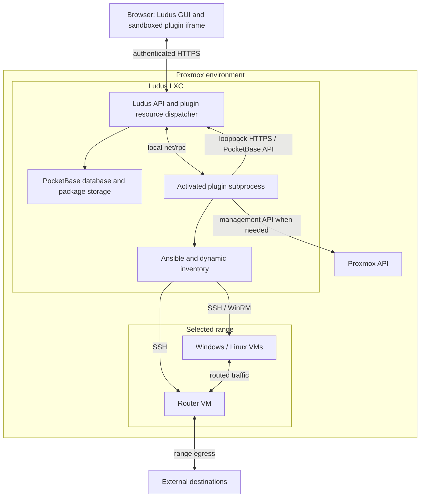

# 🔌 Plugins

Plugins add features to Ludus, such as range diagnostics, traffic monitoring, or custom tools in the web UI. A plugin can include a server component, a web interface, or both.

## What plugins can do

Plugins can:

- Add a page under **Resources → Plugins** in the web UI.
- Read range information and provide actions for the selected range.
- Run Ansible playbooks to install or configure software on range machines.
- Run scheduled jobs.
- Add actions that users can run from the plugin’s web interface or through the API.

Plugins installed by an administrator on the server can also customize how Ludus starts, stops, and deletes VMs. These VM lifecycle hooks are not available to plugins uploaded through the web UI.

## How plugins work

A plugin's server component is written in Go and compiled into a Linux executable with `go build`. It runs as a separate process on the Ludus server. Ludus sends requests to it using RPC (remote procedure calls) and returns the results to the user. Plugins can be built and updated independently, provided they support the server's plugin protocol version.

If a plugin has a web interface, it opens inside Ludus. Ludus provides the selected range and handles authenticated requests between that interface and the plugin's server component.

In an LXC installation, the plugin backend runs inside the Ludus container. Range VMs run alongside that container on Proxmox. Plugins can use Ansible to configure machines in the selected range; follow the plugin's instructions for any required range setup.



## Installing a plugin

1. Open **Resources → Plugins** in the web UI.
2. Upload the plugin's ZIP package.
3. Select **Activate** to enable it.

Uploading stores the package. Activation starts its server component, if it has one, and makes its web interface available. Activated plugins load again when Ludus restarts. If a plugin crashes, select **Activate** to start it again.

:::warning
Only activate plugins from authors you trust. Server components run with the Ludus service account's privileges and have privileged access to Ludus data.
:::

### ZIP package format

The ZIP contains the following files at its root, with the web interface under `ui/`:

```text
plugin.json
plugin           # optional compiled executable for the server's OS/architecture
ui/index.html    # optional, self-contained HTML with inline JS/CSS
```

Include only the files declared in `plugin.json`. Do not include a containing folder, directory entries, symlinks, or additional assets. At least one of `plugin` or `ui/index.html` is required. The ZIP must be no larger than 128 MiB.

## Sharing plugins

Plugins you upload are private by default. You can share them with specific Ludus users. Administrators can install a plugin for all users and manage any installed plugin.

Sharing a plugin does not grant access to your ranges. Each user still needs access to the range they want to use it with.

## Updating and deleting plugins

To update an uploaded plugin, upload the new package and select **Replace existing version**. This keeps its owner and sharing settings. Activate the new version before using it.

**Remove** hides a shared plugin from your list without affecting other users. Use **Show plugins available to add back** to restore it to your list.

**Delete** stops an uploaded plugin and removes its package. It does not stop services the plugin installed on range machines, undo machine changes, or remove data it created separately. Run the plugin's cleanup steps before deleting it.

## Troubleshooting

If activation fails, check the error shown for the plugin and the Ludus service logs. Common causes include an executable built for the wrong architecture, an incompatible plugin protocol version, or metadata that does not match `plugin.json`.

If a plugin fails while configuring range machines, check the selected range's Ansible logs for connection errors and failed tasks.
